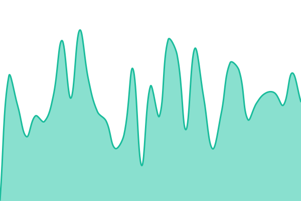
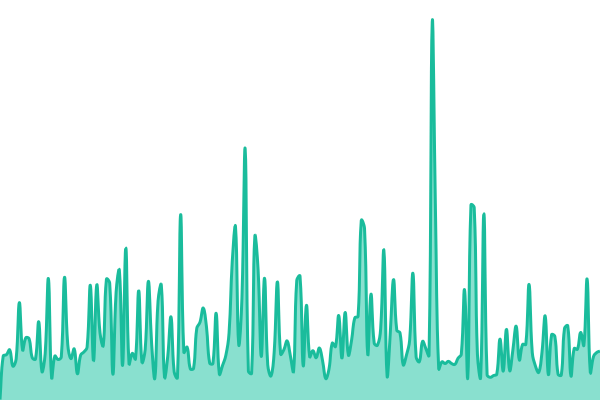
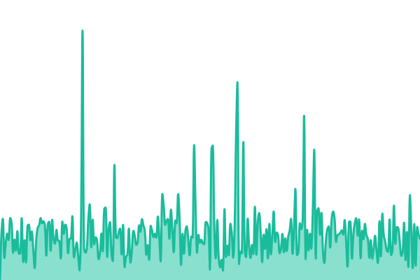
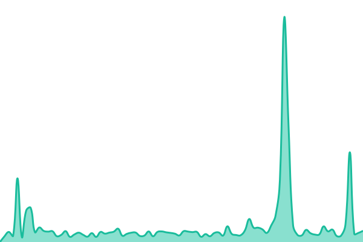
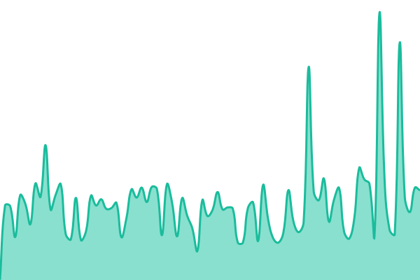

# [📈 Live Status](https://status.wheelstrategyoptions.com): <!--live status--> **🟩 All systems operational**

This repository contains the open-source uptime monitor and status page for [theperseuslabs](https://status.wheelstrategyoptions.com), powered by [Upptime](https://github.com/upptime/upptime).

With [Upptime](https://upptime.js.org), you can get your own unlimited and free uptime monitor and status page, powered entirely by a GitHub repository. We use [Issues](https://github.com/theperseuslabs/wheelstrat-status/issues) as incident reports, [Actions](https://github.com/theperseuslabs/wheelstrat-status/actions) as uptime monitors, and [Pages](https://status.wheelstrategyoptions.com) for the status page.

<!--start: status pages-->
<!-- This summary is generated by Upptime (https://github.com/upptime/upptime) -->
<!-- Do not edit this manually, your changes will be overwritten -->
<!-- prettier-ignore -->
| URL | Status | History | Response Time | Uptime |
| --- | ------ | ------- | ------------- | ------ |
|  [Website](https://wheelstrategyoptions.com) | 🟩 Up | [website.yml](https://github.com/theperseuslabs/wheelstrat-status/commits/HEAD/history/website.yml) | 

 324ms
     
 | 

<a href="https://status.wheelstrategyoptions.com/history/website">100.00%</a>
    

|  [Web app](https://wheelstrategyoptions.com/api/health) | 🟩 Up | [web-app.yml](https://github.com/theperseuslabs/wheelstrat-status/commits/HEAD/history/web-app.yml) | 

 152ms
     
 | 

<a href="https://status.wheelstrategyoptions.com/history/web-app">100.00%</a>
    

|  [Screener API](https://go.wheelstrategyoptions.com/wheelstrat/availableFilters) | 🟩 Up | [screener-api.yml](https://github.com/theperseuslabs/wheelstrat-status/commits/HEAD/history/screener-api.yml) | 

 298ms
     
 | 

<a href="https://status.wheelstrategyoptions.com/history/screener-api">100.00%</a>
    

|  [Options data](https://go.wheelstrategyoptions.com/wheelstrat/topStocksByIvr) | 🟩 Up | [options-data.yml](https://github.com/theperseuslabs/wheelstrat-status/commits/HEAD/history/options-data.yml) | 

 732ms
     
 | 

<a href="https://status.wheelstrategyoptions.com/history/options-data">100.00%</a>
    

|  [MCP server](https://mcp.wheelstrategyoptions.com/readyz) | 🟩 Up | [mcp-server.yml](https://github.com/theperseuslabs/wheelstrat-status/commits/HEAD/history/mcp-server.yml) | 

 333ms
     
 | 

<a href="https://status.wheelstrategyoptions.com/history/mcp-server">100.00%</a>
    

<!--end: status pages-->

[**Visit our status website →**](https://status.wheelstrategyoptions.com)

## 📄 License

- Powered by: [Upptime](https://github.com/upptime/upptime)
- Code: [MIT](./LICENSE) © [Anand Chowdhary](https://anandchowdhary.com)
- Data in the `./history` directory: [Open Database License](https://opendatacommons.org/licenses/odbl/1-0/)
